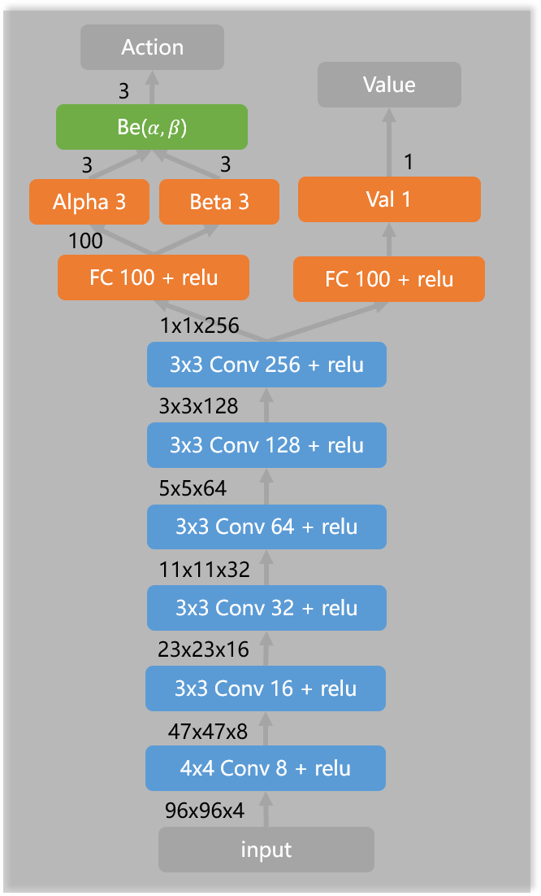

# Car Racing with PyTorch
Solving the Duckietown Gym using Proximal Policy Optimization (PPO). The simulator has been modified such that turning past 90 degrees or leaving the lane causes the episode to end.
The code for this repo is based on https://github.com/xtma/pytorch_car_caring

## Requirement
To run the code, you need the following libraries.
The version numbers are provided as a reference.
- [pytorch 1.3.1](https://pytorch.org/)
- [gym 0.17.3](https://github.com/openai/gym)
- Optionally, [ray 1.0](https://docs.ray.io/en/master/)

## Method
Every action will be repeated for 8 frames. To get velocity information, state is defined as adjacent 4 frames in shape (4, 96, 96). Use a two heads FCN to represent the actor and critic respectively. The actor outputs α, β for each acting as the parameters of Beta distribution. 
<div align=center></div>

## Training
To train the agent, run```python train.py <experiment_name>``` where the experiment name servers to identify the training run in the tensorboard.
To test, run ```python test.py --render```.p

## Training with Ray
In the folder ```ray``` training scripts for ray can be found. However, they have not been tested recently.

## Performance
Typical training perfomance from scratch is shown in red.

<div align=center></div>


## AI-DO
The ```challenge-aido_LF-template-ppo``` folder contains a submission format for the AI-DO challenge.
